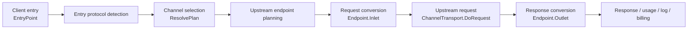
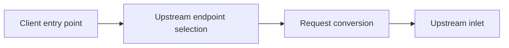
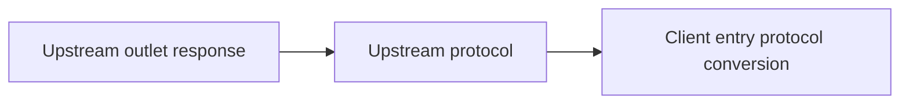
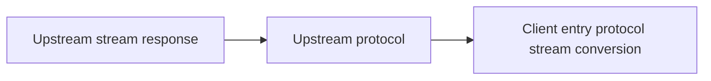

# Baize

[中文](./README.md) | [English](./README.en.md)

Baize is an AI gateway for multi-model calls. It provides one entry point for model channels, protocol conversion, adaptive routing, request queues, usage accounting, cost analytics, and diagnostic logs.

Demo: [https://baize.cloudshift.cn](https://baize.cloudshift.cn)

It keeps model access, protocol conversion, channel routing, usage settlement, and diagnostic logs inside one gateway. Application code can keep using familiar API shapes while the gateway handles provider differences, upstream volatility, usage cost, and debugging clues.

> [!IMPORTANT]
> Baize is intended only for lawful and authorized AI gateway, organization-level authentication, multi-model management, usage analytics, cost accounting, and private deployment scenarios.
>
> Users must lawfully obtain upstream API keys, accounts, model services, and interface permissions, and must comply with upstream terms of service and applicable laws.
>
> When operating this project as a public generative AI service or API resale service, users are responsible for all required filing, licensing, content safety, real-name verification, log retention, tax, payment, and upstream authorization obligations in their jurisdiction.

## Why Baize

Connecting one model service is usually not hard. The maintenance cost appears after multiple models, accounts, and teams run for a while: protocol differences leak into application code, upstream limits and account state affect availability, different workloads compete for the same model resources, failed requests need explanations, and usage cost must line up with real bills.

Baize keeps those moving parts in the gateway layer so applications can keep a stable model-call boundary.

- Stable call boundary: application code does not bind directly to provider differences; protocol adaptation and upstream endpoint selection stay in the gateway.
- Reduced failure spread: rate limits, timeouts, 5xx responses, auth failures, and quota problems go through retry, degradation, breaker, or skip paths.
- Controlled ingress traffic: request queues, priorities, and lane/user/channel concurrency and rate limits reduce the impact of traffic spikes on critical calls.
- Explainable routing: selection uses live load, latency, error rate, heartbeat, and breaker state, then records selected, skipped, and degraded channels.
- Reconciled usage cost: reservation, settlement, refund, user price, upstream cost, and usage details are recorded separately.
- Deployment path that can evolve: run as one process first, then split control plane and data plane when needed.

## Why Not Another one-api

one-api solved multi-channel aggregation and admin operations. Baize keeps those useful parts, but shifts the focus to data-plane quality: how requests enter the gateway, how protocols are converted, how channels are selected, how failures degrade, how billing is settled, and how logs explain decisions.

| Area | Common aggregator approach | Baize approach |
| --- | --- | --- |
| Forwarding | Mostly OpenAI-compatible proxying with special branches | Passthrough first; convert only when protocols differ |
| Protocol boundary | Conversion logic often spreads across channel adaptors | `EntryPoint -> Endpoint -> Inlet -> Outlet` as one model |
| Adaptor | One interface owns URL, headers, conversion, transport, response, and model list | Adaptors only declare name, auth, heartbeat, and endpoints |
| Routing | Mostly priority, weight, retry, and auto-disable | Combine pending load, EWMA latency, first-token latency, error rate, heartbeat, and breaker state |
| Health state | Failures mutate channel status or wait for manual action | Configuration and runtime state are separate; temporary failures degrade, trip breakers, and recover |
| Streaming | Protocol handlers write SSE directly | Gateway owns stream writes, per-event safety checks, logs, and usage aggregation |
| Diagnostics | Know that a request failed | Explain why a channel was selected, skipped, degraded, or had its breaker tripped |
| Deployment | Single admin + proxy process | Single process by default, with control-plane / data-plane split available |

The tradeoff is simple: **smaller channel adaptors make the gateway pipeline more uniform and cheaper to maintain.**

## Core Capabilities

- 🌐 **Multi-channel gateway**: OpenAI, Azure OpenAI, Anthropic, Gemini, Vertex AI, DashScope, Doubao, DeepSeek, Moonshot, Mistral, Minimax, Ollama, SiliconFlow, StepFun, Together AI, Cohere, Cloudflare Workers AI, Tencent Hunyuan, Xunfei Spark, Zhipu, Baidu Qianfan, and more.
- 🔌 **Multiple client API formats**: OpenAI Chat Completions, OpenAI Responses, Anthropic Messages, Gemini generateContent / streamGenerateContent / Interactions, Embeddings, Images, Audio, Rerank, video tasks, and image tasks.
- 🔁 **Passthrough and protocol conversion**: OpenAI-compatible upstreams are used directly first; OpenAI Chat / Responses, Anthropic Messages, and Gemini are converted through explicit protocol matrices.
- 🧩 **Declarative adaptors**: channels declare upstream endpoints, auth, heartbeat requests, and required request / response conversion; they do not own the full relay lifecycle.
- 🛤️ **Unified relay path**: real requests, manual channel tests, and heartbeat probes reuse the same endpoint, auth, request construction, response validation, and error classification abstractions.
- ⚖️ **Adaptive routing**: channel selection combines configured weight, pending requests, EWMA latency, first-token latency, error rate, recent failures, heartbeat, and breaker state.
- 💓 **Runtime health**: phi-style heartbeat detection and runtime breakers avoid permanently damaging channel configuration after one upstream jitter.
- 🌊 **Streaming response pipeline**: the service owns SSE writes, per-event response safety checks, log sampling, and usage aggregation, reducing channel branches that bypass shared logic.
- 💰 **Cost and accounting**: user-facing price and upstream channel cost are separated, with reservation, settlement, refund, and usage details for text, image, audio, video, and tool capabilities.
- 🔎 **Upstream model discovery**: fetch upstream models through each channel's declared `models` endpoint, both for saved channels and temporary edit-form probes.
- 🧾 **Audit and diagnostics**: request logs, usage records, channel diagnostics, runtime breaker state, response time, and upstream errors are traceable.
- 🏗️ **Control-plane / data-plane modes**: run as one process, or split with `--cp` and `--dp`.
- 🔐 **OAuth-backed channels**: Codex / OpenAI OAuth and Gemini OAuth are supported where applicable.

## Quick Start

### From Source

Requirements:

- Go 1.26.4+
- Node.js 20+
- pnpm 9+

```bash
git clone https://github.com/coding4m/wukong.git
cd wukong

cd web
pnpm install
pnpm run build
rm -rf build
cp -R dist build

cd ..
go run ./cmd --port 3000 --log-dir ./logs
```

Open `http://localhost:3000` and initialize the root account from the setup page. The current version does not rely on a fixed default password.

### Local Docker Build

```bash
docker build -t wukong:local .

docker run --name wukong -d --restart always \
  -p 3000:3000 \
  -e TZ=Asia/Shanghai \
  -e LOG_DIR=/app/logs \
  -v "$PWD/data:/data" \
  -v "$PWD/logs:/app/logs" \
  wukong:local
```

If `SQL_DSN` is not set, Baize uses SQLite by default. When embedded PostgreSQL is enabled locally, Baize uses embedded PostgreSQL. External PostgreSQL and Redis are recommended for production or multi-instance deployments.

### Docker Compose

`docker-compose.yml` is a local build deployment template. Before going online, change at least:

- `SESSION_SECRET`
- PostgreSQL credentials and `SQL_DSN`
- data and log volume paths

```bash
docker compose up -d --build
```

### Linux Packages

Requires `pnpm`, `nfpm`, and `curl`.

```bash
bash scripts/build-linux-packages.sh
```

Packages are written to `dist/packages` for `wukong`, `wukong-pilot`, and `wukong-proxy` on `amd64` / `arm64`, both `deb` and `rpm`.

## API Usage

After adding channels and tokens in the console:

```bash
export OPENAI_API_KEY="sk-your-wukong-token"
export OPENAI_BASE_URL="http://localhost:3000/v1"

curl "$OPENAI_BASE_URL/chat/completions" \
  -H "Authorization: Bearer $OPENAI_API_KEY" \
  -H "Content-Type: application/json" \
  -d '{
    "model": "gpt-4o-mini",
    "messages": [{"role": "user", "content": "hello"}]
  }'
```

Anthropic Messages and Gemini-compatible entry points are also available when the configured model, channel, and token permissions allow them.

## Common Environment Variables

| Variable | Description |
| --- | --- |
| `PORT` | listen port, default `3000` |
| `HOST` | listen host, default `0.0.0.0` |
| `SQL_DSN` | database connection string; PostgreSQL is recommended for production |
| `REDIS_CONN_STRING` | Redis connection string; recommended for multi-instance deployments |
| `SESSION_SECRET` | session secret; set a long random value in production |
| `LOG_DIR` | log directory, default `./logs` |
| `CONFIG_SYNC_INTERVAL_SECONDS` | configuration sync interval |
| `CHANNEL_REQUEST_TIMEOUT` | upstream request timeout in seconds |
| `CHANNEL_PROXY` | global upstream proxy |
| `CHANNEL_TEST_PROMPT` | prompt used by manual channel tests |
| `CHANNEL_TEST_USER_AGENT` | User-Agent used by channel tests and heartbeats |
| `CHANNEL_HEARTBEAT_INTERVAL_SECONDS` | channel heartbeat interval |
| `CHANNEL_HEARTBEAT_TIMEOUT_SECONDS` | channel heartbeat timeout |
| `CHANNEL_DIAGNOSTICS_RETENTION_SECONDS` | channel diagnostic event retention |
| `DEMO_MODE` | demo mode; disables mutations and relay requests |

See [config/config.go](./config/config.go) and [.env.example](./.env.example) for more options.

## Deployment Modes

The default is one process, which is enough for local and small private deployments. At larger scale, split it into:

- `wukong`: all-in-one mode with console and relay in one process.
- `wukong-pilot --cp`: control plane for the console, configuration, billing, and background jobs.
- `wukong-proxy --dp`: data plane for relay traffic, routing, auth, and runtime state.

For multi-instance deployments, use external PostgreSQL and configure Redis for config sync and runtime cache.

## Architecture Overview




## Design Principles

Baize keeps entry points, routing, protocol conversion, billing, and diagnostics in the gateway so multi-channel model access can remain stable, controlled, and explainable:

- Runtime-aware routing: choose better channels using configured weights, live latency, error rate, heartbeat state, and breaker state.
- Smooth health detection: use phi-style heartbeat detection to reduce false positives from short upstream jitter.
- Configuration/runtime separation: keep manual configuration stable while temporary failures are handled through runtime degradation, breaker trips, and recovery.
- Error-aware handling: treat rate limits, timeouts, auth failures, insufficient quota, and request errors differently.
- Dedicated billing facts: keep reservation, settlement, refund, and usage aggregation separate from request logs for audit and reconciliation.
- Explainable diagnostics: record why channels are selected, skipped, degraded, breaker-tripped, or recovered.
- Split-ready deployment: run as one process, or split control plane and data plane when deployment scale requires it.

## Architecture Boundaries

Baize's adaptor design has one goal: adding a channel should start with declaring its capabilities, not copying a full relay flow.

An adaptor keeps four responsibilities:

```go
type Adaptor interface {
    Name() string
    Auth() wireapi.Auth
    Heartbeat() wireapi.Heartbeat
    Endpoints() []wireapi.Endpoint
}
```

Those methods describe:

- `Name()`: channel name.
- `Auth()`: outbound authentication.
- `Heartbeat()`: minimal request for manual tests and heartbeat probes.
- `Endpoints()`: supported upstream APIs.

Traditional adaptors tend to put conversion, transport, response handling, billing, and logs inside each channel until the adaptor becomes a `God Interface`. Baize keeps the shared path in the gateway: entry detection, routing, protocol conversion, HTTP transport, response normalization, usage settlement, and audit logging use one flow. The adaptor only keeps channel-specific differences such as upstream addresses, authentication, request format, and response outlet behavior.

If protocol conversion logic is pushed into entry handlers or channel adaptors, maintenance cost grows across client protocols, upstream protocols, streaming and non-streaming paths, tool calls, and multimodal payloads. Adding a new client protocol means every channel has to understand how to receive it. Adding a new upstream protocol means several client-to-upstream paths need to be filled in. Logs, billing, safety checks, error classification, and usage aggregation then start to follow those branches too, which leads to some paths being fully observable while others miss fields or classify errors too generically.

Baize splits the problem into two layers: channel adaptors declare which upstream endpoints a provider supports, while protocol conversion happens only at the `Endpoint.Inlet` and `Endpoint.Outlet` boundaries. Adding a provider does not require that provider adaptor to understand every client protocol. Adding a protocol direction does not require rewriting each channel's relay flow. Upstream transport, streaming writes, logs, billing, safety checks, and error classification still use the same gateway pipeline, so more protocols do not force complexity into every adaptor.

Design notes:

- [relay architecture boundaries](./docs/relay-architecture-boundaries.md)
- [control / data plane split](./docs/control-data-plane-split.md)
- [runtime boundaries](./docs/runtime-boundaries.md)

## Protocol Conversion

Text and generation APIs are converted along the path of client entry point -> upstream endpoint -> client response. Image, audio, video, rerank, and other capabilities use their declared channel endpoints or capability-specific paths, so they are not included in this text-protocol section.

Request path:



| Client entry | OpenAI chat endpoint | OpenAI responses endpoint | Anthropic messages endpoint | Gemini generateContent endpoint | Gemini streamGenerateContent endpoint |
| --- | --- | --- | --- | --- | --- |
| OpenAI chat | direct | converted | converted | converted | stream converted |
| OpenAI responses | converted | direct | converted | converted | stream converted |
| Anthropic messages | converted | converted | direct | converted | stream converted |
| Gemini generateContent | converted | converted | converted | direct | n/a |
| Gemini streamGenerateContent | stream converted | stream converted | n/a | n/a | direct |
| Gemini interactions | converted | converted | converted | n/a | n/a |

Non-stream response path:



| Upstream endpoint | OpenAI chat client | OpenAI responses client | Anthropic messages client | Gemini generateContent client | Gemini interactions client |
| --- | --- | --- | --- | --- | --- |
| OpenAI chat | direct | converted | converted | converted | converted |
| OpenAI responses | converted | direct | converted | converted | converted |
| Anthropic messages | converted | converted | direct | converted | converted |
| Gemini generateContent | converted | converted | converted | direct | n/a |

Stream response path:



| Upstream endpoint | OpenAI chat client | OpenAI responses client | Anthropic messages client | Gemini streamGenerateContent client | Gemini interactions client |
| --- | --- | --- | --- | --- | --- |
| OpenAI chat | direct | converted | converted | converted | converted |
| OpenAI responses | converted | direct | converted | converted | converted |
| Anthropic messages | converted | converted | direct | n/a | converted |
| Gemini streamGenerateContent | converted | converted | converted | direct | n/a |

Gemini Interactions is currently a client-facing mode. It can be backed by OpenAI chat, OpenAI responses, or Anthropic messages, but it is not used as an upstream endpoint for non-Gemini channels.

## Development

```bash
go test ./...

cd web
pnpm install
pnpm run dev
```

Key directories:

- `channel/wireapi`: protocol, endpoint, request, response, and error models.
- `channel/adaptor`: channel capability declarations, auth, and heartbeat requests.
- `channel/service`: relay request/response handling, billing, logs, and runtime state.
- `routes` / `router`: HTTP API and console endpoints.
- `web`: Vue / Element Plus console.

## Contributing

Issues, design discussions, and pull requests are welcome. Before contributing, read [Architecture Boundaries](#architecture-boundaries) and [relay architecture boundaries](./docs/relay-architecture-boundaries.md) to avoid turning channel differences into another large interface.

Development guidelines:

- When adding a channel, prefer declaring `Endpoints()`, auth, and necessary inlet / outlet conversion instead of putting a full relay flow inside the adaptor.
- Protocol conversion, billing, audit, and security checks should reuse the shared gateway pipeline where possible.
- Changes touching relay flow, billing, diagnostics, or runtime routing should include tests or clear verification notes.
- Distribution changes for docs, Docker, or Linux packages must preserve `LICENSE`, `NOTICE`, `THIRD_PARTY_NOTICES.md`, and `web/LICENSE`.

## License

Baize is licensed under the [GNU Affero General Public License v3.0](./LICENSE), with the AGPLv3 Section 7 additional terms listed in [NOTICE](./NOTICE).

Modified versions that present a user interface must preserve Baize attribution and the original project link in a prominent about, legal, footer, or attribution location:

```text
Baize is an open-source AI gateway derived from one-api.
https://github.com/coding4m/wukong
```

This project is derived from [one-api](https://github.com/songquanpeng/one-api), which is licensed under the MIT License. Upstream MIT notices, third-party notices, and frontend base project notices are documented in [NOTICE](./NOTICE), [THIRD_PARTY_NOTICES.md](./THIRD_PARTY_NOTICES.md), and [web/LICENSE](./web/LICENSE).

If your organization cannot comply with AGPLv3 network-service obligations, contact the project maintainers for commercial licensing. Regardless of the authorization model, notices for one-api, the frontend base project, and third-party dependencies must still be preserved.
